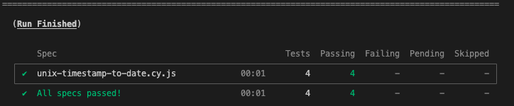
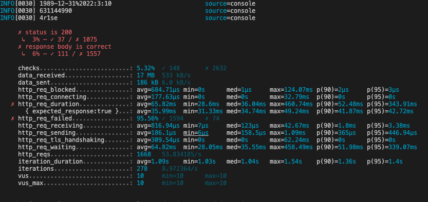

# unix-timestamp-api-testing
API performance testing on UNIX timestamp converted to Date and vise versa ( https://helloacm.com/tools/unix-timestamp-converter/ )

## Installation

Checkout the repository to run first the Cypress API tests to verify that works as expected (use Node latest lts version ) : 

```console
npm i
```
After package installation use the following command to run the basic tests :

```console
npm run test
```
You should see the following report to your terminal :



## Performance Test Tool Installation 

We will use k6s for Performance testing, a new tool writen in Go and you can write easily tests in Javascript.

### Debian/ Ubuntu 

```console
sudo gpg -k
sudo gpg --no-default-keyring --keyring /usr/share/keyrings/k6-archive-keyring.gpg --keyserver hkp://keyserver.ubuntu.com:80 --recv-keys C5AD17C747E3415A3642D57D77C6C491D6AC1D69
echo "deb [signed-by=/usr/share/keyrings/k6-archive-keyring.gpg] https://dl.k6.io/deb stable main" | sudo tee /etc/apt/sources.list.d/k6.list
sudo apt-get update
sudo apt-get install k6

```
### MacOS

```console
brew install k6
```

### Windows

```console
winget install k6
```

### Docker

```console
docker pull grafana/k6
```

You can select what works for you.

## Run Performance Tests

If you use OS installation you can use the following command

```console
k6 run performance-tests.js 
```
or with Docker 
```console
 docker run --rm -i grafana/k6 run - <performance-tests.js
```
Predefined settings are 10 virtual users will make requests to API for 30 seconds.

The API has cache mechanism so to make it like a real world scenario we added a function that creates a random date, so on each request
will be different.

Since the API also is protected by Cloudflare anti-spamming and often makes requests to fail you will see some flakiness to results.

We will also use `http.batch` function of k6s to simulate multiple HTTP requests together to issue them in parallel over multiple TCP connections.

## RESULTS

The implementations have both for static parameters and for random parameters to avoiding caching results for 3 scenarios :

1. Date -> Timestamp
2. Timestamp -> Date
3. Invalid Date string 




